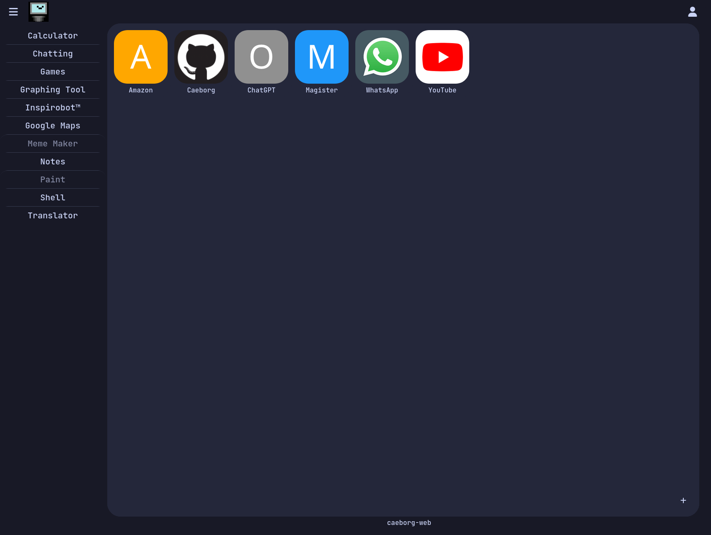

## Table of Contents
- [Introduction](#introduction)
- [Todo](#todo)
    + [CaeborgDiscordBot functions to implement:](#caeborgdiscordbot-functions-to-implement-)
- [Notes](#notes)
- [Setup](#setup)
  * [Server setup](#server-setup)
  * [Development](#development)
- [Development dependencies](#development-dependencies)

## Introduction
Caeborg is an all-in-one homepage that includes different tools for my day-to-day. The idea behind it is that I can unify the most popular tools I use into one environment.


# Todo
* Optimize frontend HTML CSS & JS
    * Fix `shell.ts` (pretty much broken)
    * Fix launcher image loading
    * Rebuild sidebar hiding
    * Animations everywhere?
    * Light mode?
* New features:
    * Chat features:
        - image preview, confirm image sending
        - message menu, reply to message
        - link previews
        - optimize loading
    * Translator dictionary API
    * Write Notes tool
    * Write Paint tool
    * OpenAI API with CaeborgGPT, DALL-E?
    ### CaeborgDiscordBot shell commands to implement:
    * deofhet
    * weather
    * ascii
    * meme

# Notes
* To run the web server, run `go run main.go` in `caeborg-web/`.
* To run the server in its dev mode, run `go run main.go dev` in `caeborg-web/`. `dev` includes SCSS compilation.
* To compile SCSS to CSS separately, run `sass --watch ./client/public/styles:./client/public/.css` in `caeborg-web/`.

# Setup
## Server setup
```
[Unit]
Description=Caeborg
Requires=network.target
After=network.target systemd-ask-password-console.service multi-user.target

[Service]
User=root
WorkingDirectory=/var/www/caeborg.dev
ExecStart=/usr/bin/sudo /var/www/caeborg.dev/releases/caeborg_linux_arm64
ExecReload=/usr/bin/sudo /var/www/caeborg.dev/releases/caeborg_linux_arm64
Type=simple
Restart=always
TimeoutSec=360

[Install]
WantedBy=default.target
```
* Copy the example systemd service file to the systemd services folder `/usr/lib/systemd/system/` as root.
* Enable the service with `systemctl enable --now caeborg`.
* Don't forget to `chmod +x ./releases/*` and `chmod +x ./server/besticon/*` to avoid permission errors.
## Development
For your development environment to work correctly, you need to set up HTTPS keys. These are self-signed keys intended only for development use.
* Create a private key `openssl genrsa -out ./assets/credentials/privkey.pem 4096`.
* To create the self-signed SSL key, run `openssl req -x509 -newkey rsa:4096 -keyout ./assets/credentials/privkey.pem -out ./assets/credentials/fullchain.pem -sha256 -days 365`.
* Then remove the passcode `openssl rsa -in ./assets/credentials/privkey.pem -out ./assets/credentials/privkey.pem -passin pass:1234`.
* These keys are saved in `caeborg-web/assets/credentials` during development.
    * The required keys are `cert.pem` and `key.pem` for HTTPS.
    * An `auth_secret` file is also necessary for encryption.
* The server also requires an `assets/chat.json` and an `assets/user.json` file.
    * Example of `users.json`:
     ```json
    {
        "johnappleseed": {
            "launcher": {
                "YouTube": "youtube.com"
            },
            "password": "X3xikhbQf87bK0k=",
            "whitelist": {
                "a2eb9c82-071d-4b0a-a645-1c48273d6477": 1705572938
            }
        }
    }
    ```

# Development dependencies
* `go` (v1.21)
* `dart-sass` or `node-sass` is required for SCSS transpilation.
* `typesecript` and `tsc-watch` is requried for TypeScript transpilation.
